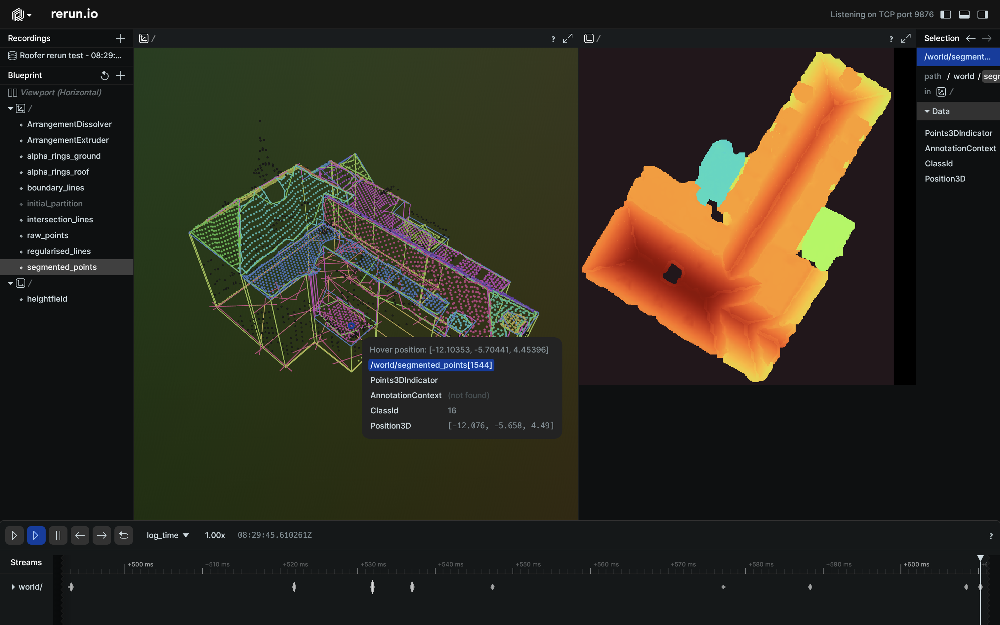

# roofer
Automatic 3D building reconstruction

## Overview src/ folder (possibly subject to change)
`src/common.hpp` and `src/Raster.hpp` contains some basic types to store pointclouds, polygons, rasters etc that are used throughout the library. Only depends on the C++17 standard library.

`src/detection` and `src/partitioning` contain everything needed to perform building reconstruction (see `apps/reconstruct.cpp` for how to use). These files only depend on CGAL, there are not other external dependencies.

`src/io` contains functions to read and write OGR/GDAL datasources and LAS files. Has a bunch of external dependencies like GDAL, GEOS, PROJ, LASlib

`src/misc`, `src/quality` various function used by the `crop` application.

## Roofer apps

### crop
Takes a bunch of input las files and footprints and outputs a folder hierarchy with reconstruction inputs for each separate building

### reconstruct
Takes a point cloud and footprint for a single building and performs building reconstruction.

Currently it is using rerun.io to visualise the result. You need to install the rerun viewer if you want to see the output.



## Compile from source

Building *roofer* requires [vcpkg](https://vcpkg.io).
Follow the [vcpkg instructions](https://learn.microsoft.com/en-gb/vcpkg/get_started/get-started?pivots=shell-cmd) to set it up.
After *vcpkg* is set up, set the `VCPKG_ROOT` environment variable to point to the directory where vcpkg is installed.

On *macOS* you need to install additional build tools:

```shell
brew install autoconf autoconf-archive automake libtool
```

export PATH="/opt/homebrew/opt/m4/bin:$PATH"

Clone this repository and use one of the CMake presets to build the roofer.

```sh
cd roofer-dev
mkdir build
cmake --preset vcpkg-minimal -S . -B build
cmake --build build
# Optionally, install roofer
cmake --install build
```

You can list all available presets:

```shell
cd roofer-dev
cmake --list-presets
```

## Logging

There are two logging backends available, the internal and `spdlog`.
Roofer defaults to the internal logger, which logs to the console.
With `spdlog`, roofer logs to the console and to a JSON log file.
To use `spdlog`, set the `RF_USE_LOGGER_SPDLOG` CMake variable `ON`.

The logging verbosity is controlled with the `-v, --verbose` and `-t, --trace` options.

### Tracing
The `roofer` app can trace object counts and the amount of heap allocation during its process.
To enable tracing, pass the `--trace` option to `roofer`.
It is strongly recommended to use `spdlog` if you enable tracing, so that the logs are stored as JSON in the `roofer.log.json` logfile.
The `tools/plot_traces.py` python script can help you to plot the tracing information.
The script requires the `matplotlib` and `pandas` libraries to run, it takes the log file as its single argument and writes the plot to `roofer_trace_plot.png`.
