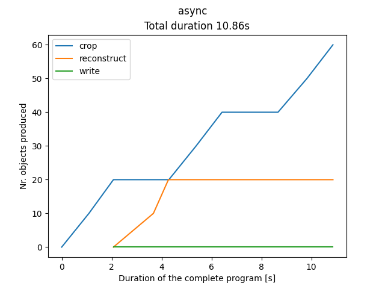

# Parallel processing

The goal of this experiment is to develop a method for parallel processing in roofer.

We use the shared memory model for parallelism and thus merge the cropping, reconstruction and serialization into a single application.
We also discussed message passing, but discarded the idea, because we did not see the need for it in the scope of the current project, and it would increase the complexity of the software.

This experiment developed four alternative processing methods for roofer.
Each stored in its own source file in `experiments/parallel-reconstruct/tests`.
These sources are compiled into executables and run by CTest.

The experiment uses a simplified imitation of the crop, reconstruct and serialization part of roofer.
The amount of input is controlled by the `NrLAZ` and `NrPointsPerLAZ` CMake variables in `experiments/parallel-reconstruct/tests/CMakeLists.txt`.
The first controls the number or las files to be read, the second controls the number of points per las file.

The plots below show the amount of buildings processed over time by each part, crop (blue), reconstruct (orange), serialization (green).

The process for running the experiment and producing the plots is described in `experiments/parallel-reconstruct/justfile`.

## 1. Sequential (baseline)

`test_sequential.cpp`

Baseline implementation.

- Run the cropper, reconstructor and serializer in sequence, on a single thread.
- Each part fully finishes processing before the next begins.
- Data is passed in queues between the parts.

## 2. Streaming

`test_streaming.cpp`

- The cropper is a generator that yields the cropped points of *one* building at a time, processing multiple las files in a sequence.
- Reconstruction and serialization runs in a tight loop with the cropper, processing one building after another, until the cropper is finished.
- Data is passed directly, there is no need for a queue.

## 3. Parallel reconstruction

`test_parallel_reconstruct.cpp`

- The cropper is a generator that yields the cropped points of buildings of one las file, processing multiple las files in a sequence.
- Reconstruction run in parallel per building, distributing the cropped points of one las file among the threads at once. Parallelization is done with the libfork library.
- Serialization is sequential, after the reconstruction has finished.
- Data is passed in queues between the parts.

## 4. Async parallel

`test_async.cpp`

- The cropper is a generator that yields the cropped points of buildings of one las file, processing multiple las files in a sequence.
- Reconstruction run in parallel per building, distributing the cropped points of one las file among the threads at once. Parallelization is done with the libfork library.
- Serialization is sequential, after the reconstruction has finished.
- Data is passed in queues between the parts.
- Each part runs on its own thread, parallel to each other, producing and consuming data.
- Condition variables signal the waiting part when data is available on the queue.

